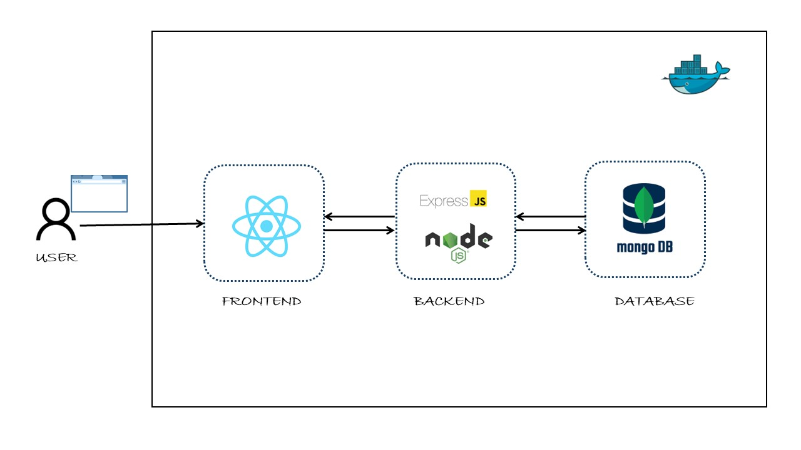

## Project Overview

This project demonstrates a fully containerized 3-tier **MERN** (MongoDB, Express, React, Node.js) web application. It showcases robust containerization practices by transforming an existing codebase into a secure, functional, and reproducible environment using **Docker** and **Docker Compose**.

A MERN Stack Application that includes:
- **MongoDB** for the database layer  
- **Express.js** and **Node.js** for the backend logic and server  
- **React.js (Vite)** for the frontend UI



## Components

- **Frontend:** React (Vite)
- **Backend:** Node.js / Express (with CRUD + Pagination)
- **Database:** MongoDB

### Prerequisites

- Docker installed and running (Linux, Windows, or macOS)
- Git (e.g., Git Bash for Windows)

### Setup Instructions

1. **Clone the Repository**
   ```bash
   git clone https://github.com/icnoka/fullstack-todo-list Azubi-MERN-Stack-App
   cd Azubi-MERN-Stack-App

2. **Create the .env File**
In the root of the project, create a .env file and paste the following:

`
# MongoDB Secrets
MONGO_ROOT_USER=admin
MONGO_ROOT_PASSWORD=dbpassword
MONGO_DB_NAME=todos
`

3. **Build and Run the Containers** 
`
docker compose up --build -d
`
4. Access the Application
`
Open your browser and visit: http://localhost
`
5. Stop the Application
`
docker compose down
`

***Project Enhancements***
The original application was improved to support full containerization, complete functionality, and better security:

- API URL Correction: Frontend API calls use relative paths for compatibility with reverse proxy routing.

- Full CRUD: Implemented missing PUT and DELETE endpoints in the backend.

- Pagination: Added page and limit query support to GET /api/gettodos.

- Body Parsing Fix: Corrected backend JSON parsing issues.

- Frontend Build Fix: Resolved syntax error in AddTodoForm.jsx.

***Architecture & Security Highlights***
- Private Docker Network: All containers communicate securely via an internal bridge network.

- Nginx Reverse Proxy: Serves the frontend and proxies API requests to the backend, protecting internal services.

- Minimal Exposure: Only frontend port 80 is exposed to the host.

- Secure Credentials: Secrets managed using a .env file (excluded from version control).

- Persistent Storage: MongoDB uses a named Docker volume (mongo-data) to retain data across container restarts

**Container Testing Script**
Make Executable (One Time)
```
chmod +x Scripts/App_testing.sh
```
*Run Script*
```
./Scripts/App_testing.sh
```
*Expected output:*
```
--- Verifying Containerized Application ---
Waiting 10 seconds for services to fully start...
1. Testing Frontend... SUCCESS: Frontend is accessible.
2. Testing Backend via Reverse Proxy (/api/gettodos)... SUCCESS: Backend responded with data.

All checks passed! The application is running correctly.
```
***Troubleshooting Guide***
**Port 8080 Already in Use**
Cause: Another service, Apache is using port 8080.
Fix: Stop the conflicting service or edit docker-compose.yml to change:
ports:
  - 8080:80
Then access the app at ```http://localhost:80```


**Frontend Loads but No Data / Save Fails**
Cause: Backend or database service is down.
Fix: Inspect logs with:
docker logs azubi-mern-stack-app-frontend-1

**Project Structure**
```
Azubi-MERN-App/
├── Backend/           # Node.js + Express API
├── Frontend/          # React (Vite) frontend
├── Script/           # Test scripts
├── assets/            # Folder for images
├── .env               # Environment secrets (excluded from Git)
├── docker-compose.yml
└── README.md
```

 ## Libraries Used

In this project, I've used the following libraries:

- **dotenv:** A zero-dependency module that loads environment variables from a `.env` file into `process.env`. [dotenv](https://www.npmjs.com/package/dotenv)
- **Express:** A fast, unopinionated, minimalist web framework for Node.js. [Express](https://expressjs.com/)
- **Mongoose:** A MongoDB object modeling tool designed to work in an asynchronous environment. [Mongoose](https://mongoosejs.com/)
- **Nodemon:** A utility that monitors for any changes in your source and automatically restarts your server. [Nodemon](https://nodemon.io/)


   
